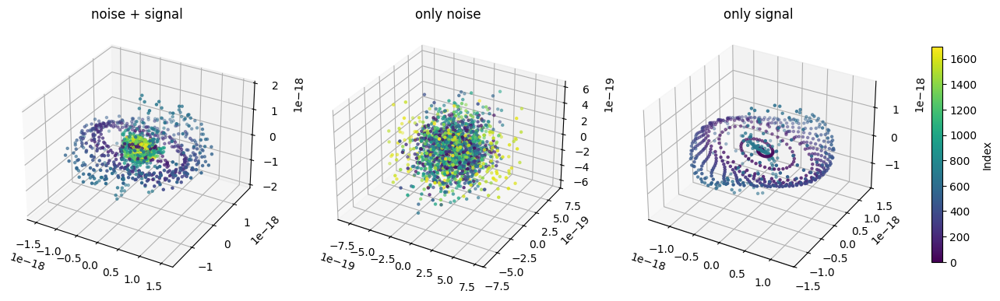

# tda-gravitational-waves

This repo contains code used to generate plots and train a simple Convolutional Neural Network (CNN) for a coursework assignment in the Topological Data Analysis (TDA) course at the University of Warsaw in 2025.
The topic was to write simple article about the Takens' Theroem with example of the usecases.

One may read the article in the file `article.pdf`.

## Code structure 
You can find the accompanying article in the file article.pdf.
Code Structure

    Jupyter Notebooks – contain code for generating images and visualizations.

    pipeline.py – defines the TDA pipeline.

    net.py – defines the neural network, along with training and testing loops.

## References

Some code was adapted from [Giotto-TDA](https://giotto-ai.github.io/gtda-docs/latest/notebooks/gravitational_waves_detection.html): Gravitational Waves Detection, especially for data generation (data/ directory).
